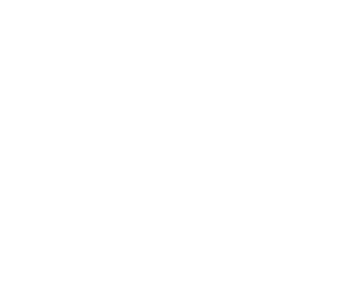

<!-- Greeting -->
# Greetings, I'm Junda! :wave:

<!--Introduction -->
I'm a **Senior Machine Learning Engineer** at [Rakuten](https://global.rakuten.com/corp/innovation/technology/), a leading e-commerce platform in Japan with global presence. Outside of work, I tinker with Tensor libraries such as CUDA and RocM. I'm exploring the intersection of machine learning with reactor physics, digital twins, and physics-informed neural networks.

- 📚 I’m working extensively with RAG at work.
- 🔭 ~8 YOE with production ML: PyTorch, CUDA, numpy, pandas.
- 🔬 I'm currently learning nuclear engineering fundamentals and building ML models for reactor simulation.
- 🧪 Exploring physics-informed neural networks (PINNs) for thermal-hydraulics modeling.

---

### For analytics, I use

<code></code>
<code></code>
<code></code>
<code></a></code>
<code></code>

### For web development, I use

<code></code>
<code></code>
<code></code>
<code></code>
<code></code>
<code></code>

### Currently getting familiar with

<code></code>
<code></code>

<!-- Comment -->
[comment]: <> (Inspired from:)

[comment]: <> (https://github.com/JoykishanSharma)

[comment]: <> (https://github.com/sw-yx/sw-yx)
